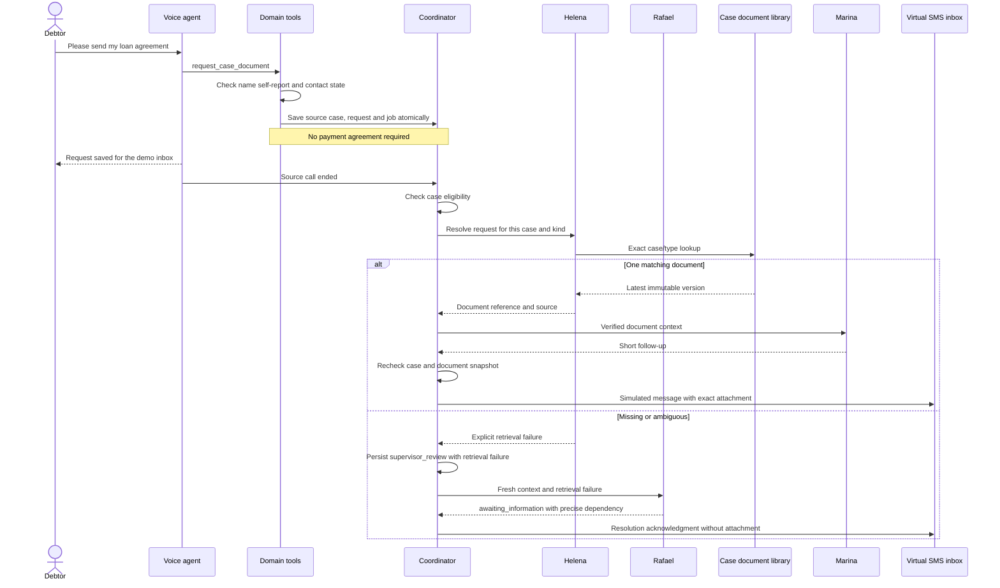
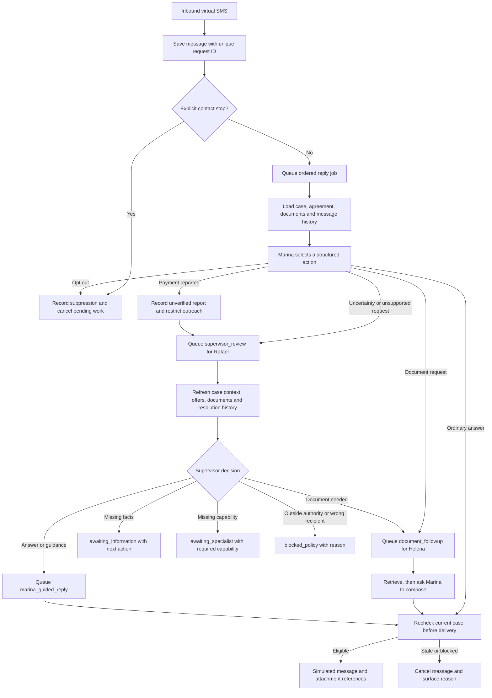
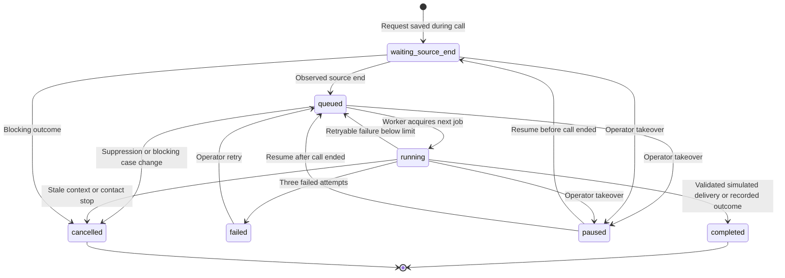
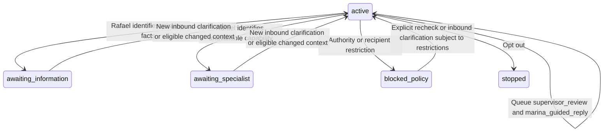
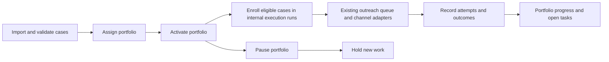
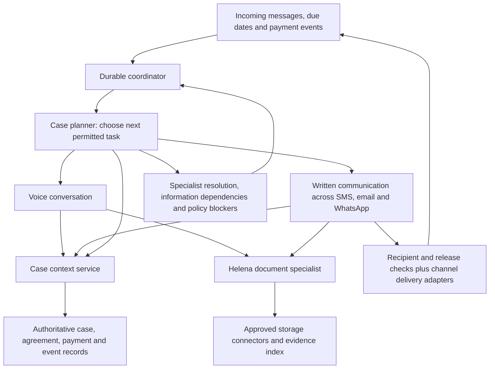
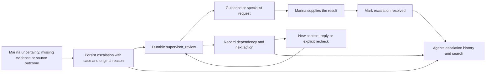

# Rescova workflow map

Updated: 15 September 2026. These diagrams describe the implementation unless explicitly marked **planned**. Update this file in the same change whenever a trigger, task state, agent responsibility, or delivery mechanism changes.

## Scope and ownership

Current delivery is **virtual SMS inside the authenticated operator app**. No document is emailed or physically texted by these workflows. The workspace is single-organization; multi-tenant authorization is not implemented. Name confirmation is pilot self-report, not documentary identity verification. Do not reuse virtual-inbox authorization for releasing real documents to external recipients.

| Role | Current responsibility | Implementation |
| --- | --- | --- |
| Clara | English GPT-Live conversation | Voice model with delegated domain tools |
| Sofia | Alternative Grok conversation | Voice model using shared domain tools |
| Lucas | GPT-Live tool execution decisions | Configurable backend model |
| Helena | Resolve a document request within one case | Deterministic retrieval specialist; no additional LLM call |
| Marina | Compose follow-ups, answer written questions, request documents | Provider-independent structured model adapter |
| Rafael | Own unresolved case decisions using refreshed context | Durable supervisor_review job; bounded guidance and specialist handoff |
| Coordinator | Persist, order, schedule, cancel and retry work | Application service |

Helena currently supports exact document type matching, not open-ended semantic search. She returns source metadata and an immutable document version. This narrow contract can later be implemented with search/OCR/storage connectors without changing the conversation or delivery interface.

## 1. Accepted payment agreement

```mermaid
sequenceDiagram
    actor Debtor
    participant Voice as Clara or Sofia
    participant Tools as Domain tools
    participant Case as Case database
    participant Queue as Coordinator
    participant Marina
    participant Inbox as Virtual SMS inbox
    Debtor->>Voice: Confirm name and accept authorized solution
    Voice->>Tools: agree_payment_solution
    Tools->>Case: Save agreement and source case
    Tools->>Queue: Persist agreement_followup
    Note over Case,Queue: Atomic save; one case per provider/session
    Queue-->>Queue: Wait for observed call end
    Voice->>Queue: Source call ended
    Queue->>Marina: Agreement, payment instructions, conversation
    Marina-->>Queue: Structured reply
    Queue->>Queue: Recheck case version and contact eligibility
    Queue->>Inbox: Save simulated message and exact payment block
    Debtor->>Inbox: Reply
    Inbox->>Queue: Durable inbound message and reply job
    Queue->>Marina: Updated case context and ordered history
```

A payment report is unverified. It never reduces the balance or increases confirmed recovery. The separate payment-follow-up draft remains an operator artifact, not proof of delivery.

## 2. Document request during a call



Every newly persisted Ana demo source receives two clearly fictional text documents. Ordinary uploaded portfolio cases are not seeded. Uploads are plain text, at most 100 KiB, attached to a specific case. Reusing a title and type creates a new version; multiple distinct titles of one type require clarification instead of guessing. A resolved request stays pinned to its selected version.

Downloads require the authenticated operator session and matching case/document IDs. Attachments are rendered from stored IDs, never model-generated URLs. Original text is downloadable; only bounded excerpts are supplied to Marina for questions. Helena currently uses the database behind a library interface; external storage connectors, PDF/OCR ingestion and semantic retrieval are **planned**.

## 3. Written conversation and specialist requests



The same source call maps to one case and one conversation whether documents or a payment agreement come first. Relevant delivered document excerpts persist through database references and are reloaded for subsequent questions. No global model conversation stores all debtors.

## 4. Durable task lifecycle



The single-process worker serializes jobs. Restart requeues interrupted model generation, preserving request IDs and observed call-end records. Failed older jobs prevent later replies from overtaking them. Shared suppression, case restrictions and portfolio pause are checked before and after generation. A missing document creates a durable supervisor resolution, not endlessly retried generation.

Job statuses above are distinct from conversation resolution states below. A completed supervisor job can leave a conversation waiting for an actual dependency. The resolution stores its reason, next action and context; an absent capability is never represented as a completed specialist action.



A recheck creates another supervisor job and re-evaluates current restrictions; it does not grant permission or clear a reported payment, dispute or contact stop. Information and specialist waits also monitor eligible context changes. An unchanged missing dependency does not create an endless model loop. There is no configured human channel for these virtual workflows. Requests for a person must be acknowledged transparently and remain blocked by that missing channel, not falsely reported as transferred.

## 5. Portfolio operation today



This existing portfolio flow is separate from isolated voice-demo fulfillment. Its legacy outcome enums, imported-case review queues and explicit operator controls remain for compatibility; this change does not migrate every historic or manual process into autonomous execution. It does not yet implement a model-driven daily strategy loop or verified payment reconciliation. Demo source portfolios stay excluded from prospecting.

## Target architecture — planned, not implemented



Keep domain tools, task state, storage interfaces and message contracts independent of model providers. Introduce a new agent when its responsibilities and permissions differ enough to justify it. Planned steps include real two-way delivery, stronger external document-release authorization, after-call review, payment reconciliation, and continuous portfolio planning.

## Code map and acceptance

- Source-case and agreement persistence: server/demo-platform.mjs
- Voice document tool: server/browser-voice.mjs, server/grok-voice.mjs, server/twilio-test.mjs
- Document storage/retrieval: server/documents.mjs
- Ordering, shared context, delivery and cancellation: server/agent-workflows.mjs
- Model adapter and written agent policy: server/agent-models.mjs
- Case documents and conversation attachments: src/CaseDocuments.jsx, src/AgentConversations.jsx

To test manually: start a fresh browser voice test, confirm Ana Silva, ask for the original loan agreement, wait for the saved request, and end the test. Open Demo SMS conversations, download the attachment, ask a question about it, then request the account statement. No payment acceptance is needed. Test a payment agreement in the same call to confirm both tasks share one case.


## Written payment-option questions

For document-only Ana demo conversations, Marina receives the same approved offer catalog and dated schedules as the voice tools. Questions about installments or upfront discounts use an ordinary reply, without creating an agreement or escalating a routine question. Existing accepted agreements remain authoritative. The text agent can explain offers; recording acceptance through text is not implemented yet and must not be claimed.


## Supervisor resolution contract

Marina returns an unresolved request to Rafael rather than sending it to a human queue. Primary legacy `human_review` model decisions normalize to `escalate_supervisor`; Rafael's legacy or repeated escalation output becomes an explicit policy blocker. Supervisor jobs and guided Marina replies are separate durable executions, with provider-independent contracts and run traces.

A reported payment requires authoritative verification and restricts further collection; neither Rafael nor Marina can confirm receipt or clear balances. Saving text agreements and payment verification integrations remain unavailable capabilities in this slice. Missing documents route through Helena and then to an explicit information request if retrieval is missing or ambiguous. Opt-outs stop contact immediately without waiting for Rafael. Supervision never authorizes new terms, bypasses document release restrictions or changes an operator/portfolio pause.


## Escalation tracking

The Agents overview includes **Supervisor escalations**. Each distinct referral stores its original trigger and reason, case/conversation links, current status, next action, and creation/update times. Rechecks update the same escalation; another independent referral creates a new record. Resolved and cancelled entries remain available for diagnosis. The table shows the latest 200 records; older records remain stored and are available through the paginated endpoint.



Records begin with this implementation; historical human-review tasks are not falsely reclassified as Rafael consultations. Full workflow events and model runs remain accessible through the linked conversation. The API is GET /api/agent-workflows/escalations with an optional offset; it is protected by the same workspace authentication as case data.
