# Rescova workflow map

Updated: 16 September 2026. These diagrams describe the implementation unless explicitly marked **planned**. Update this file in the same change whenever a trigger, task state, agent responsibility, or delivery mechanism changes.

## Scope and ownership

Default delivery is **virtual SMS inside the authenticated operator app**. An agent-requested or explicitly activated **Google Workspace email test** sends fictional demo messages and seeded documents from/to `louiz@rescova.de`; physical SMS is still not enabled by these agent workflows. The workspace is single-organization; multi-tenant authorization is not implemented. Name confirmation is pilot self-report, not documentary identity verification. Do not reuse virtual-inbox authorization for releasing real documents to external recipients.

| Role | Current responsibility | Implementation |
| --- | --- | --- |
| Clara | English GPT-Live conversation | Voice model with delegated domain tools |
| Lucas | GPT-Live tool execution decisions | Configurable backend model |
| Helena | Resolve a document request within one case | Deterministic retrieval specialist; no additional LLM call |
| Marina | Compose follow-ups, answer written questions, request documents | Provider-independent structured model adapter |
| Rafael | Own unresolved case decisions using refreshed context | Durable supervisor_review job; bounded guidance and specialist handoff |
| Coordinator | Persist, order, schedule, cancel and retry work | Application service |

Helena currently supports exact document type matching, not open-ended semantic search. She returns source metadata and an immutable document version. This narrow contract can later be implemented with search/OCR/storage connectors without changing the conversation or delivery interface.

## 1. Accepted payment agreement

```mermaid
sequenceDiagram
    actor Debtor
    participant Voice as Clara or Sofia
    participant Tools as Domain tools
    participant Case as Case database
    participant Queue as Coordinator
    participant Marina
    participant Inbox as Virtual SMS inbox
    Debtor->>Voice: Confirm name and accept authorized solution
    Voice->>Tools: agree_payment_solution
    Tools->>Case: Save agreement and source case
    Tools->>Queue: Persist agreement_followup
    Note over Case,Queue: Atomic save; one case per provider/session
    Queue-->>Queue: Wait for observed call end
    Voice->>Queue: Source call ended
    Queue->>Marina: Agreement, payment instructions, conversation
    Marina-->>Queue: Structured reply
    Queue->>Queue: Recheck case version and contact eligibility
    Queue->>Inbox: Save simulated message and exact payment block
    Debtor->>Inbox: Reply
    Inbox->>Queue: Durable inbound message and reply job
    Queue->>Marina: Updated case context and ordered history
```

A payment report is unverified. It never reduces the balance or increases confirmed recovery. The separate payment-follow-up draft remains an operator artifact, not proof of delivery.

## 2. Document request during a call

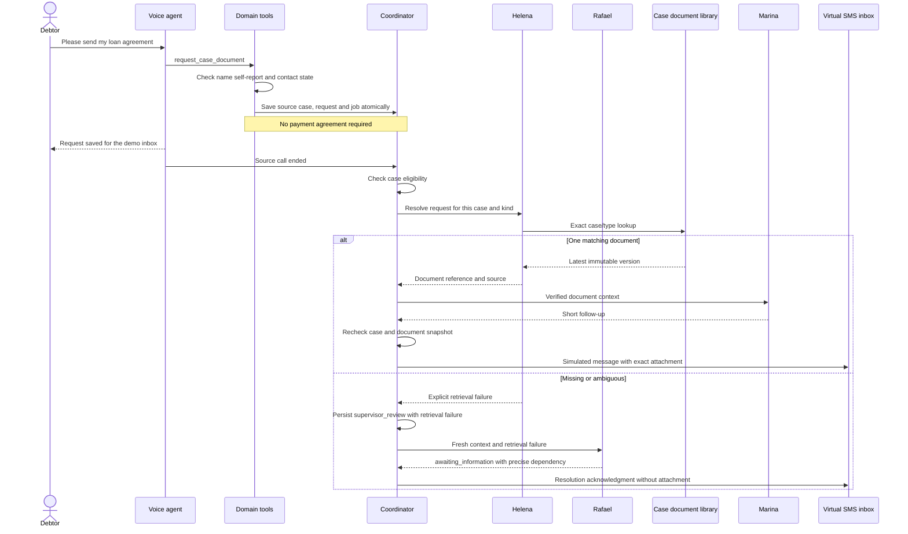

Every newly persisted Ana demo source receives two clearly fictional text documents. Ordinary uploaded portfolio cases are not seeded. Uploads are plain text, at most 100 KiB, attached to a specific case. Reusing a title and type creates a new version; multiple distinct titles of one type require clarification instead of guessing. A resolved request stays pinned to its selected version.

Downloads require the authenticated operator session and matching case/document IDs. Attachments are rendered from stored IDs, never model-generated URLs. Original text is downloadable; only bounded excerpts are supplied to Marina for questions. Helena currently uses the database behind a library interface; external storage connectors, PDF/OCR ingestion and semantic retrieval are **planned**.

## 3. Written conversation and specialist requests

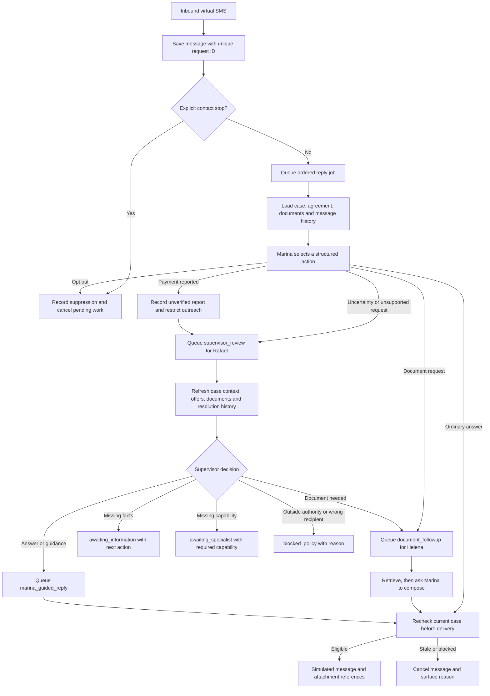

The same source call maps to one case and one conversation whether documents or a payment agreement come first. Email and demo SMS messages share this conversation, case facts, document evidence and authorized offer records; channels are retained per message and per queued job. Relevant delivered document excerpts persist through database references and are reloaded for subsequent questions. No global model conversation stores all debtors.

## 4. Durable task lifecycle

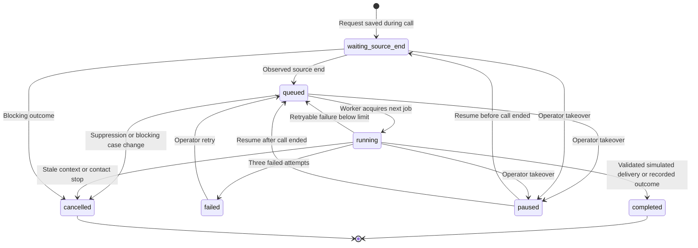

The single-process worker serializes jobs. Restart requeues interrupted model generation, preserving request IDs and observed call-end records. Failed older jobs prevent later replies from overtaking them. Shared suppression, case restrictions and portfolio pause are checked before and after generation. A missing document creates a durable supervisor resolution, not endlessly retried generation.

Job statuses above are distinct from conversation resolution states below. A completed supervisor job can leave a conversation waiting for an actual dependency. The resolution stores its reason, next action and context; an absent capability is never represented as a completed specialist action.

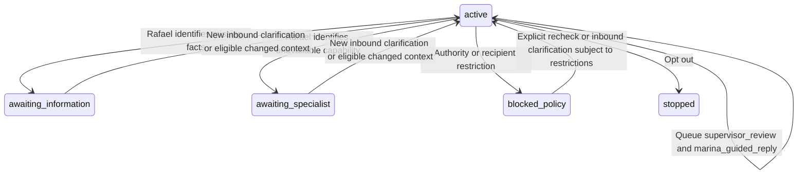

A recheck creates another supervisor job and re-evaluates current restrictions; it does not grant permission or clear a reported payment, dispute or contact stop. Information and specialist waits also monitor eligible context changes. An unchanged missing dependency does not create an endless model loop. There is no configured human channel for these virtual workflows. Requests for a person must be acknowledged transparently and remain blocked by that missing channel, not falsely reported as transferred.

## 5. Portfolio operation today

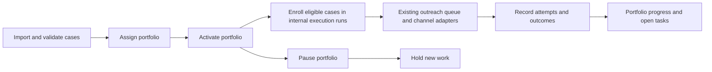

This existing portfolio flow is separate from isolated voice-demo fulfillment. Its legacy outcome enums, imported-case review queues and explicit operator controls remain for compatibility; this change does not migrate every historic or manual process into autonomous execution. It does not yet implement a model-driven daily strategy loop or verified payment reconciliation. Demo source portfolios stay excluded from prospecting.

## Target architecture — planned, not implemented

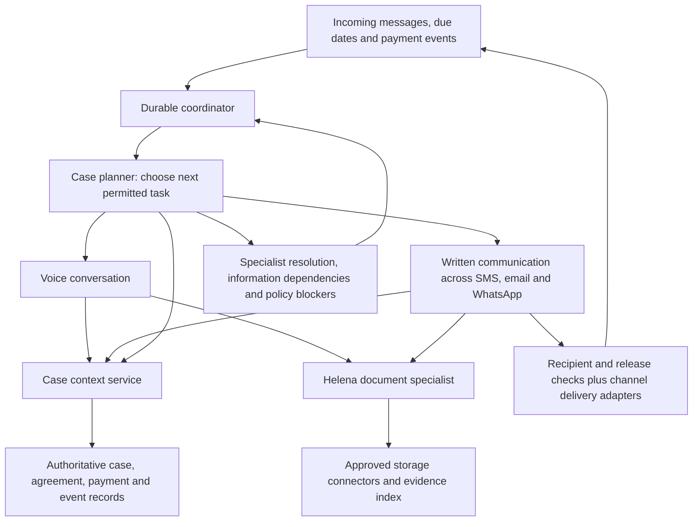

Keep domain tools, task state, storage interfaces and message contracts independent of model providers. Introduce a new agent when its responsibilities and permissions differ enough to justify it. Planned steps include real two-way delivery, stronger external document-release authorization, after-call review, payment reconciliation, and continuous portfolio planning.

## Code map and acceptance

- Source-case and agreement persistence: server/demo-platform.mjs
- Voice document tool: server/browser-voice.mjs, server/twilio-test.mjs
- Document storage/retrieval: server/documents.mjs
- Ordering, shared context, delivery and cancellation: server/agent-workflows.mjs
- Model adapter and written agent policy: server/agent-models.mjs
- Case documents and conversation attachments: src/CaseDocuments.jsx, src/AgentConversations.jsx

To test manually: start a fresh browser voice test, confirm Ana Silva, ask for the original loan agreement, wait for the saved request, and end the test. Open Demo SMS conversations, download the attachment, ask a question about it, then request the account statement. No payment acceptance is needed. Test a payment agreement in the same call to confirm both tasks share one case.


## Written payment-option questions

For document-only Ana demo conversations, Marina receives the same approved offer catalog and dated schedules as the voice tools. Questions about installments or upfront discounts use an ordinary reply, without creating an agreement or escalating a routine question. Existing accepted agreements remain authoritative. The text agent can explain offers and record one explicit acceptance through the shared validated agreement persistence. The application appends exact dated terms and stores the presented offer; email acceptance additionally requires that offer message to have been submitted. Existing agreements cannot be amended by this action.


## Supervisor resolution contract

Marina returns an unresolved request to Rafael rather than sending it to a human queue. Primary legacy `human_review` model decisions normalize to `escalate_supervisor`; Rafael's legacy or repeated escalation output becomes an explicit policy blocker. Supervisor jobs and guided Marina replies are separate durable executions, with provider-independent contracts and run traces.

A reported payment requires authoritative verification and restricts further collection; neither Rafael nor Marina can confirm receipt or clear balances. Text agreements are available through validated acceptance of previously presented authorized offers; payment verification remains unavailable. Missing documents route through Helena and then to an explicit information request if retrieval is missing or ambiguous. Opt-outs stop contact immediately without waiting for Rafael. Supervision never authorizes new terms, bypasses document release restrictions or changes an operator/portfolio pause.


## Escalation tracking

The Agents overview includes **Supervisor escalations**. Each distinct referral stores its original trigger and reason, case/conversation links, current status, next action, and creation/update times. Rechecks update the same escalation; another independent referral creates a new record. Resolved and cancelled entries remain available for diagnosis. The table shows the latest 200 records; older records remain stored and are available through the paginated endpoint.

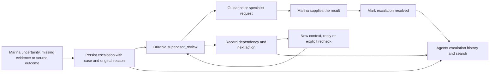

Records begin with this implementation; historical human-review tasks are not falsely reclassified as Rafael consultations. Full workflow events and model runs remain accessible through the linked conversation. The API is GET /api/agent-workflows/escalations with an optional offset; it is protected by the same workspace authentication as case data.


## 6. Google Workspace test delivery and replies — implemented

This is an agent-requested demo transport, separate from the legacy portfolio SendGrid adapter. An explicit email request in a call or written conversation creates the delivery binding automatically; optional manual activation remains for troubleshooting. See [EMAIL_TEST.md](EMAIL_TEST.md) for OAuth setup and test steps. No DNS/webhook infrastructure is required. OAuth uses send + read-only scopes, and the application reads only registered test threads. Gmail is one delivery adapter; agent roles and model profiles remain unchanged.

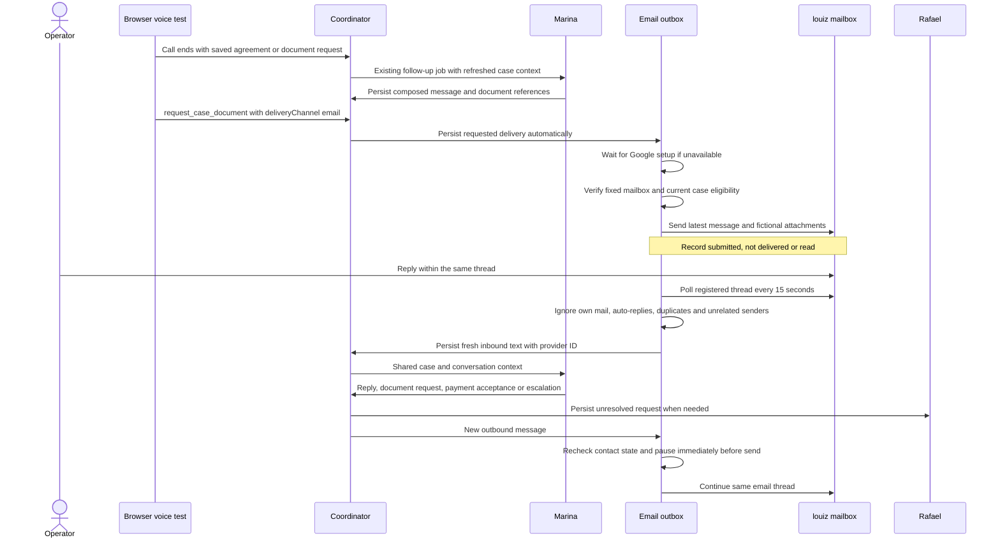

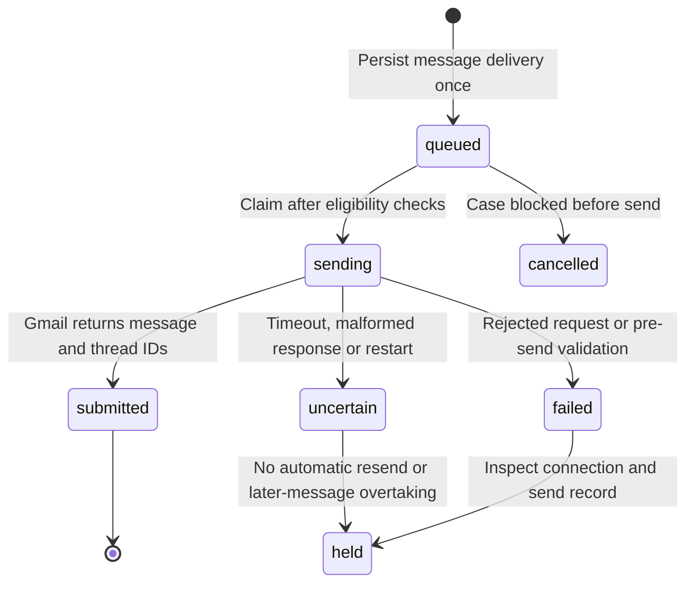

An email binding has active, paused and awaiting_configuration states. Agent-requested delivery requires no manual case activation. After setup is available it automatically sends eligible email-tagged messages; SMS-tagged messages are never swept into that binding. Optional manual activation transfers only the latest selected existing message and future email work, not a historical bulk replay. Pausing retains case context and holds synchronization/delivery; it cannot recall submitted mail. The fixed test recipient is enforced outside the model. Only seeded fictional document versions may be attached; external release of operator uploads remains planned. Email delivery states are separate from agent-generation completion and from virtual-inbox messages.

A thread reply must reference a stored outbound RFC Message-ID and come from the fixed mailbox. Fresh plain text is bounded; quoted history is stripped. Inbound attachments and HTML-only email are not processed. Unknown/repeated events never invent a new case. Replies can trigger immediate opt-out or existing Rafael resolution. No general mailbox scan is performed. Uncertain outcomes are held without a retry button; Gmail delivery/read events, bounce reconciliation and wider recipients remain planned.

## 7. Written agreement acceptance — implemented

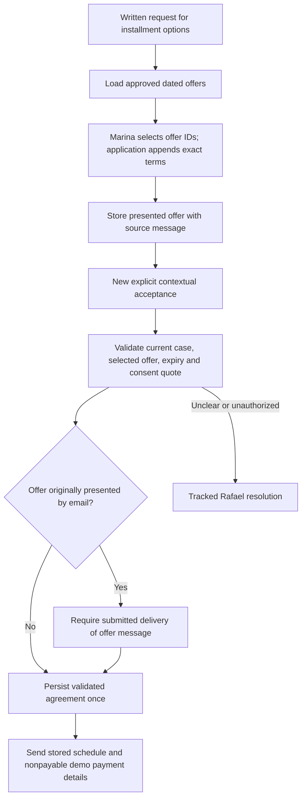

One unambiguous contextual acceptance suffices. Questions and negated/hypothetical statements are not acceptance. The quoted consent must occur in the latest inbound text; multiple presented options require an identifiable choice. Existing agreement replays are idempotent; replacing an agreement requires an unavailable amendment capability. Acceptance is not payment receipt.


## 8. Agent-selected channels and shared case context — implemented

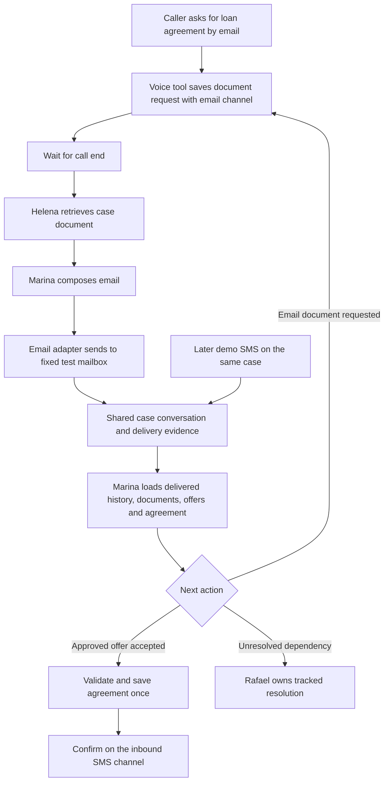

A channel is a delivery route, not a separate case or agent memory. Each durable job snapshots its response channel so a later inbound SMS cannot redirect an already queued email. Inbound provider IDs are deduplicated before changing routing. Delivered email history is usable on SMS; unsent email drafts are excluded from customer-visible history, and the acceptance gate checks the original offer's channel and submission evidence. Default replies follow the inbound channel; explicit written document delivery requests can select another channel through the model's structured action. Missing Google setup is persisted as a waiting dependency and does not become a manual send requirement. Physical SMS remains a future adapter integration for these agent workflows; the current SMS entry is the case's virtual test inbox.


## Shared case facts and on-demand knowledge — implemented

The default model input contains working case identity/state, relevant payment state, document metadata and the latest 24 communicated messages. It does not contain every case event, note or document body. Marina and Rafael can select `lookup_case_information` with a topic, optional document ID and offset. The coordinator executes a case-scoped read and returns just that result for the next model step. Topic reads include case/portfolio details, activity, follow-ups, contact attempts, documents, document content, delivery, payment terms and earlier conversation history.

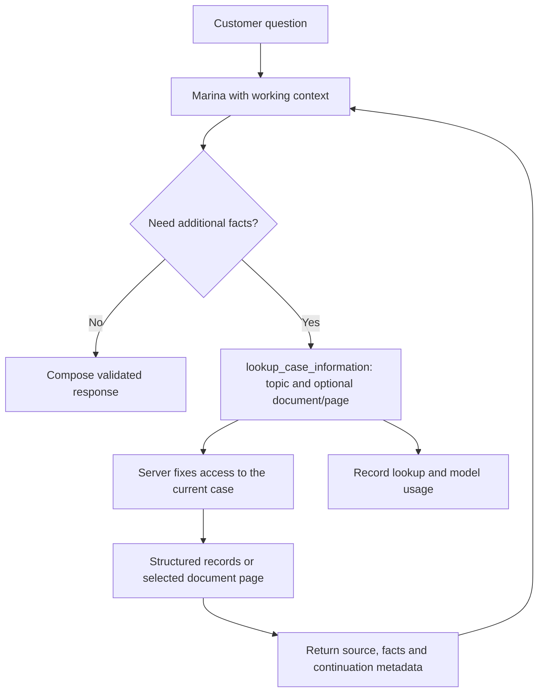

For “which bank?”, Marina looks up `case_details` and receives the recorded portfolio creditor. A document omitting the creditor does not erase the portfolio record. Case/portfolio changes participate in the generation snapshot to reject stale output. Unconfirmed payment reports remain distinct from verified balances.

Lists return ten records per page and document text returns 6,000 characters with explicit continuation. All stored pages are addressable; a single turn has at most four distinct lookups, and repeated requests are bounded. Missing/ambiguous information stays explicit. Full call transcripts are not automatically linked to case records. Raw imports, verification hashes and provider credentials are excluded. Internal operational notes support reasoning, not verbatim customer disclosure. Lookup results are untrusted evidence, never new instructions.

## Retrieval architecture — implemented lexical search; semantic retrieval planned

Helena remains deterministic. Exact case/portfolio/agreement facts come from structured reads. The `document_search` lookup accepts a query and returns ranked, case-scoped text passages with document ID, version and physical page. Current-version filtering prevents superseded versions from competing with current evidence. SQLite FTS5 or PostgreSQL full-text search executes retrieval; snippets remain untrusted evidence, never permission to change payment terms.

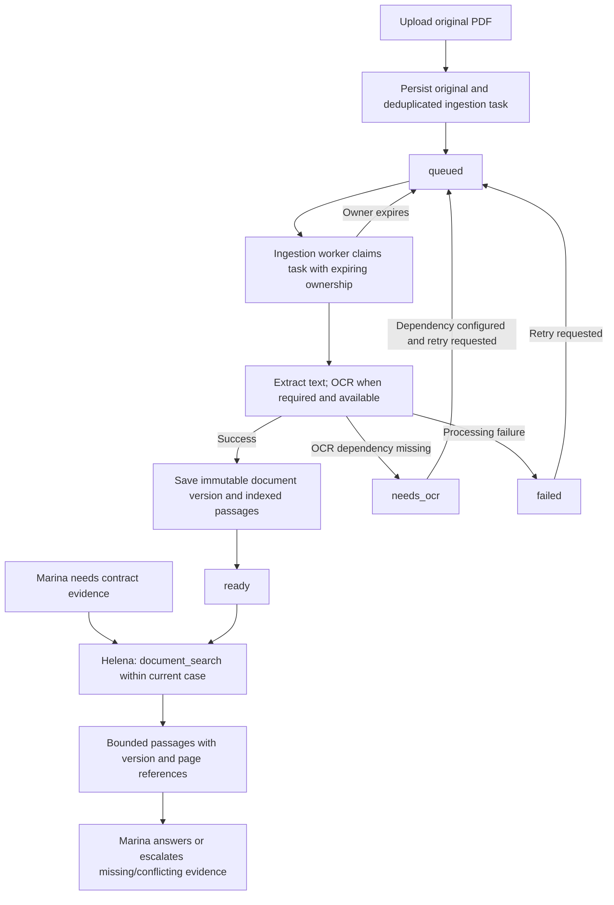

Text uploads are versioned and indexed directly. Original PDFs use shared filesystem storage; object storage remains planned. Embeddings/hybrid search and graph retrieval are deferred until retrieval evaluations demonstrate a need. Ingestion has separate durable ownership from conversation work and can run on dedicated workers.

## Parallel agent execution and recovery — implemented

The API and workers use the same PostgreSQL records. Agent and email workers share a per-case lease so channels cannot independently mutate the same workflow at once. Independent cases execute concurrently; the earliest eligible job in a case runs first. Task channels remain fixed. Waiting source closure and failed earlier jobs block later work in that case.

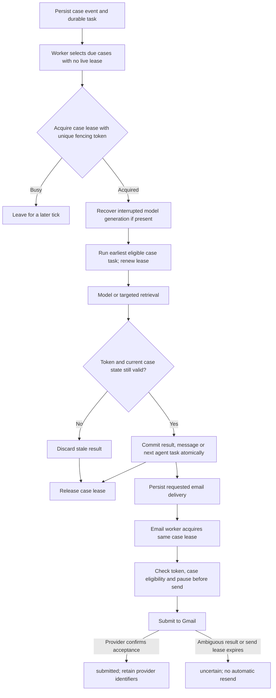

Fencing is checked inside the database transaction before model results commit, and immediately before external email submission. A request already sent to a provider cannot be recalled by losing a lease. Expired model work is recoverable; expired sending is held as uncertain. Worker startup does not reset other processes' running tasks. Graceful shutdown stops scheduling and drains/aborts owned work.

One API process remains required because HTTP sessions, voice sessions and the legacy portfolio dispatcher are not cluster-ready. Set `APP_WORKERS_ENABLED=false` on that API when separate workers schedule background work. Standalone roles are `all`, `agent`, `email` and `ingestion`; email synchronization currently also ticks the agent queue. These limits and migration/monitoring procedures are documented in [OPERATIONS.md](OPERATIONS.md). Horizontal API replication, provider-wide distributed rate limiting and production throughput guarantees remain planned.


## Outreach evidence and agent task oversight — implemented read projections

The Overview activity panel reads persisted Twilio test calls, Gmail delivery records, virtual SMS messages and legacy contact attempts. It groups the latest fourteen calendar days in America/Sao_Paulo by Calling, SMS and Email. The summary UI uses a stacked chart and a compact color legend, plus aggregate external/simulated counts; detailed channel status lists remain outside this summary. Provider-backed transport and simulated activity remain distinguishable. Mirrored provider IDs are deduplicated. Browser debug sessions are separate; unrecorded browser history cannot be reconstructed. Gmail submission is not delivery/read evidence, and Twilio completion is not right-party confirmation.

Agent tasks projects existing agent jobs, unresolved supervisor dependencies, document ingestions and email deliveries into one paginated view. Marina and Rafael own their current jobs; Helena's ingestion is deterministic; email sending is attributed to the delivery worker. Case and conversation links lead to current workflow controls. Closed includes completed/submitted work and cancellations; original states remain visible. Legacy follow-ups remain separately labeled with no invented agent executor. This screen does not create a new ticket-processing engine.

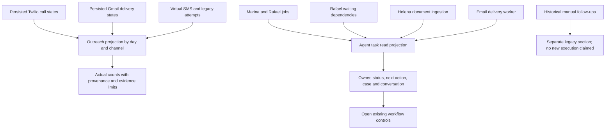

## Canonical tickets and verified payment loop — planned, not yet implemented

The next infrastructure increment will unify typed tasks, source events, inbox/outbox, timers and completion contracts. PostgreSQL coordination and the existing model-neutral domain capabilities remain the foundation. Payment-provider eligibility and funds flow are unresolved; no live payment collection is enabled by this plan.

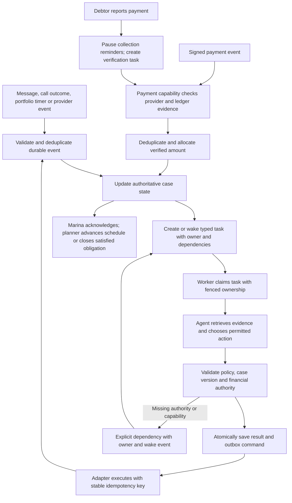

Financial postings, partial allocations and reversals are deterministic and auditable. An agent can own verification without deciding monetary truth from generated text. Full roadmap, scenario handling and acceptance gates: [AGENTIC_ROADMAP.md](AGENTIC_ROADMAP.md). Current maturity and remaining gaps: [ASSESSMENT.md](ASSESSMENT.md).


## Durable document fulfillment ticket — implemented, 16 September 2026

New voice and written document requests create a `document_tickets` parent in the same transaction as the existing document request and `document_followup` job. The request ID is unique; retries retain one ticket and the original delivery channel. Existing jobs, case leases and email outbox remain the executors. Historical work is not backfilled or resent.

Agent tasks displays the parent instead of duplicating its linked job/email rows. **View ticket** shows retrieval, composition and delivery evidence, ownership, retry usage and deadline. The source document request pins an immutable version. A later file version does not alter an already selected attachment.

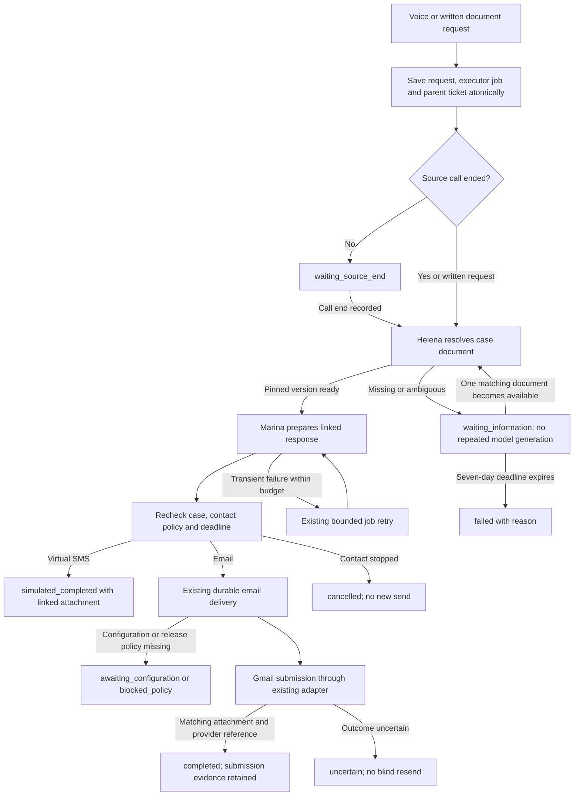

The deadline sweep and dependency wake-up run under existing case leases. Waiting for a missing document does not consume model retries; generation is bounded to three attempts, including recovered interrupted generation. Closed ticket jobs cannot be revived by the generic conversation retry control. A terminal failure keeps its cause visible; automated acquisition of missing external documents or release permissions is not implemented. Rafael is the accountable exception owner, not a claim that a new supervisor job has executed.

A parent email ticket completes only with its correlated message, pinned document attachment, submitted delivery and provider message ID. Email submission does not prove inbox delivery or reading. SMS completion is explicitly simulated. An uncertain external send is held. Existing explicit email activation for a previously completed virtual-SMS message remains a separate transport action and does not reroute or reopen that parent ticket.

Real email release still permits only seeded fictional documents. User-uploaded PDFs can support retrieval and virtual-SMS fulfillment but do not automatically gain external release authorization. Contact eligibility and pause rules apply immediately before sending. No new live calls or email tests were initiated during automated validation.

Test instructions: [DOCUMENT_TICKET_TEST.md](DOCUMENT_TICKET_TEST.md). The general task/inbox/outbox platform and payment reconciliation in the preceding planned diagram remain future work; this slice implements one bounded document contract.


## Payment confirmation and supervisor loop protection (16 September 2026)

A selected, valid, previously sent payment offer without explicit consent produces one clarification from Marina. The reply job completes and waits for a new participant message; it does not create a supervisor task. Ambiguous selection asks the participant to name the offer. No agreement is saved before the existing consent, terms, expiry and submission checks pass.

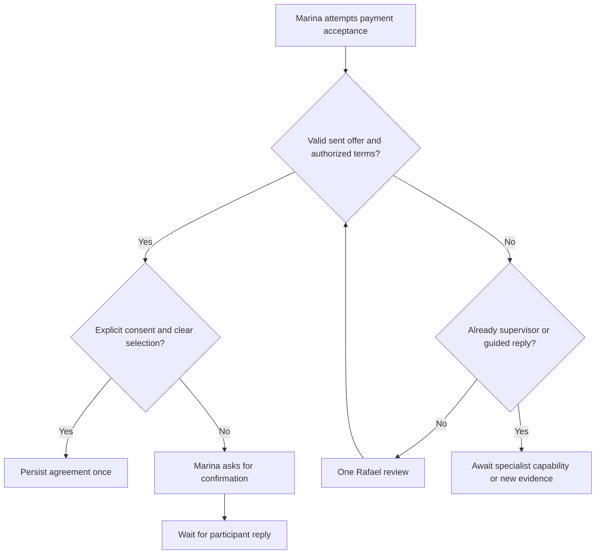

All calls to supervisor referral enforce the same recursion guard, including payment-tool validation failures. Existing conversation resolution states synchronize outstanding escalation records; resolved/cancelled history stays intact. Further execution requires a new message or evidence through the existing wake-up mechanism, rather than an immediate self-referral.

## Implemented payment simulation loop — 16 September 2026

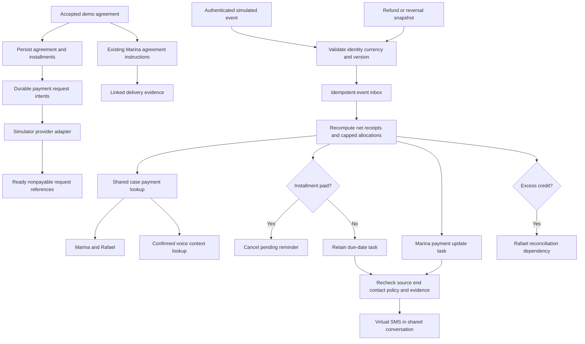

Payment events, accounting projections and notification tasks commit atomically under the same case-lease protocol as conversation work. No model changes financial balances. Duplicate/stale events do not reapply funds or create duplicate tasks. Missing provider capabilities remain explicit dependencies. Initial instruction tasks link to the existing agreement message rather than independently sending it again; new payment notifications remain virtual SMS. Historical accepted demos get financial records but no invented provider receipt.

**Planned, not enabled:** actual payment-provider adapter, signed public webhook endpoint, periodic provider reconciliation, real payment notification delivery, recurring portfolio collection cadence and a universal outbox/timer executor. See [PAYMENTS.md](PAYMENTS.md) for the adapter contract, edge cases and test steps.


### Voice provider simplification — 16 September 2026

Clara remains the GPT Live voice agent with Lucas handling delegated case tools. Sofia and the Grok browser test have been removed from the active registry, UI, API and WebSocket runtime. Browser GPT Live and Twilio workflows continue unchanged. Historical Grok cases, agreements and debug recordings remain readable; they are not active voice endpoints.
